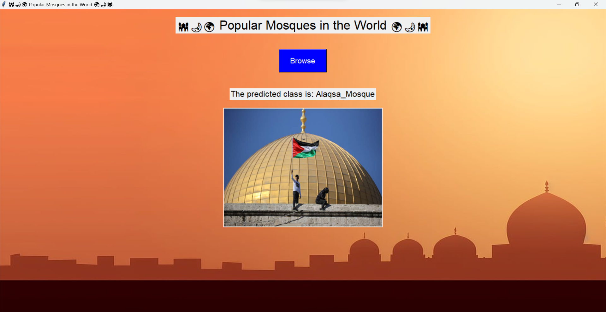

# 🕌🌙🌍 Popular Mosques Image Classification 🌍🌙🕌

This project focuses on scraping images from different websites about 6 popular mosques around the world and building a deep learning model to classify them. The model is trained using convolutional neural networks (CNNs) and leverages the MobileNetV2 architecture pre-trained on the ImageNet dataset.

## Key Highlights:

- Data Scraping: Scrape data from different websites using Selenium and BeautifulSoup.
- Data Exploration: Explore the dataset to understand its structure and distribution.
- Data Preprocessing: Augment the images to increase the size of the dataset and split it into training, validation, and test sets.
- Model Training: Build and train a CNN using the MobileNetV2 architecture. We freeze the base layers of the model and fine-tune the top layers for mosque classification.
- Model Evaluation: Evaluate the trained model on the test set to assess its performance in terms of accuracy and loss.
- Data Prediction: Demonstrate how to use the trained model to make predictions on new mosque images.
- Simple Deployment: Designing GUI using Tkinter to predict the images that are browsed.

### Explore the dataset on [Kaggle](https://www.kaggle.com/datasets/abdelrahmanahmed110/popular-mosques-in-the-world/data). 🚀
### Explore the notebook on [Kaggle](https://www.kaggle.com/code/abdelrahmanahmed110/notebook7b5518d6cb). 🚀
### Check out my portfolio [Here](https://www.linkedin.com/posts/abdelrahman-eldaba-739805192_datascience-dataanalysis-webscraping-activity-7156428468711219201-gtWA/). 🌟
### Connect with me on [LinkedIn](https://www.linkedin.com/in/abdelrahman-eldaba-739805192/). 🌐

Feel free to explore, provide feedback, and connect with me for discussions and collaborations! 🤝🚀
